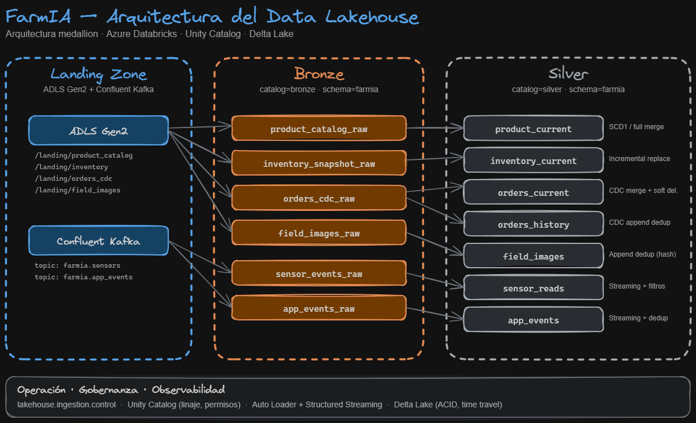
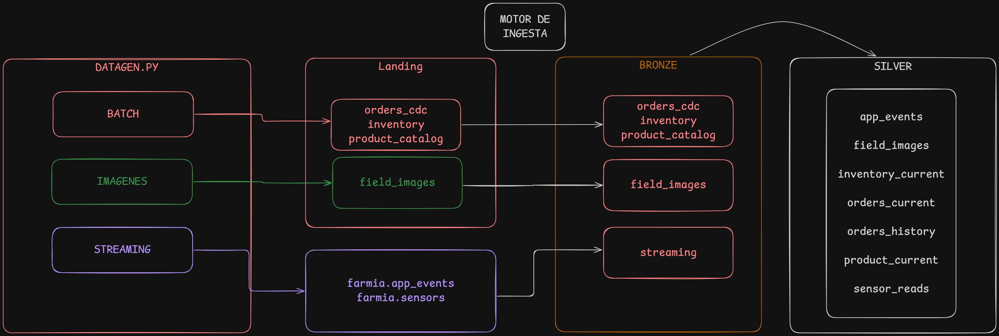
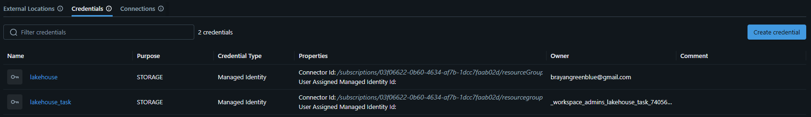
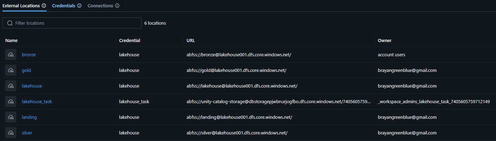
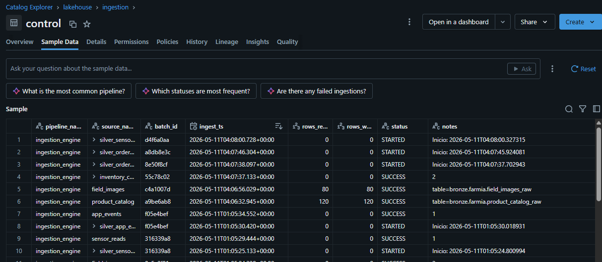
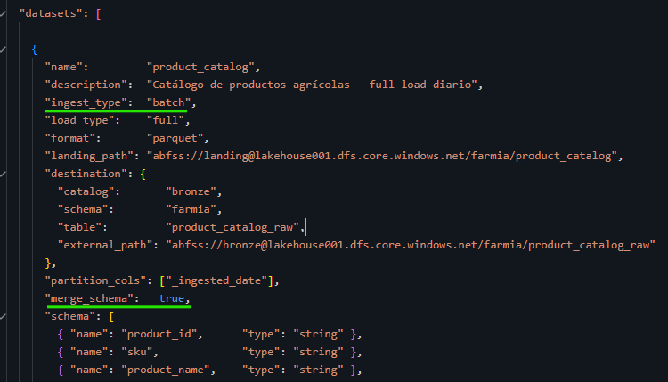

# FarmIA — Motor de Ingesta y Data Lakehouse

<!-- [](https://azure.microsoft.com/products/databricks)
[](https://delta.io/)
[](https://www.databricks.com/product/unity-catalog)
[](https://www.confluent.io/)
[](https://spark.apache.org/docs/latest/structured-streaming-programming-guide.html) -->

Plataforma de **data lakehouse** para FarmIA construida sobre **Azure Databricks**, **Delta Lake** y **Unity Catalog**, siguiendo el patrón **medallion** (Landing → Bronze → Silver). El motor de ingesta está implementado en **PySpark / Structured Streaming** y soporta de forma unificada fuentes batch (archivos en ADLS Gen2) y streaming (Confluent Kafka), todo configurado por dataset en JSON declarativo.

---

## Tabla de contenidos

1. [Parte 1 — Diseño de la arquitectura](#parte-1--diseño-de-la-arquitectura-del-data-lakehouse)
2. [Parte 2 — Motor de ingesta](#parte-2--motor-de-ingesta)
   - [Visión general](#visión-general)
   - [Configuración de datasets](#configuración-de-datasets)
   - [Metadatos técnicos](#metadatos-técnicos)
   - [Evolución de esquema](#evolución-de-esquema)
   - [Logging operacional](#logging-operacional)
3. [Estructura del proyecto](#estructura-del-proyecto)
4. [Setup y despliegue en Databricks](#setup-y-despliegue-en-databricks)
5. [Guía de ejecución](#guía-de-ejecución)
6. [Modelo semántico](#modelo-semántico)
7. [Reset en desarrollo](#reset-en-desarrollo)

---

## Parte 1 — Diseño de la arquitectura del Data Lakehouse

FarmIA adopta una **arquitectura medallion** sobre Azure Databricks que separa las responsabilidades en tres zonas bien delimitadas: una **Landing Zone** que actúa como punto de aterrizaje físico de las fuentes en ADLS Gen2 (más los tópicos de Confluent Kafka), y dos capas lógicas en Unity Catalog — **Bronze** y **Silver** — que refinan progresivamente los datos desde su forma cruda hasta tablas listas para análisis.

El diseño persigue cuatro objetivos:

- **Trazabilidad total** de cualquier dato Silver hasta su origen, mediante linaje en Unity Catalog y registro operacional en `lakehouse.ingestion.control`.
- **Idempotencia y reprocesabilidad** de cada capa, apoyándose en Delta Lake (ACID + time travel) y patrones de merge / dedup explícitos.
- **Soporte unificado batch + streaming**, usando Databricks Auto Loader (`cloudFiles`) para archivos y Structured Streaming sobre Kafka para tiempo real.
- **Separación clara entre dato técnico y dato analítico**, evitando que la lógica de limpieza contamine la capa de ingesta.

### Diagrama de arquitectura



### Flujo simplificado



### Estructura de cada capa

#### Landing Zone — punto de aterrizaje (ADLS Gen2 + Kafka)

La Landing Zone **no es una capa de tablas**, sino un conjunto de rutas en ADLS Gen2 (`abfss://landing@lakehouse001.dfs.core.windows.net/farmia/...`) donde aterrizan los archivos producidos por los sistemas fuente y por el generador sintético (`datagen/`). Convive con los **tópicos de Confluent Kafka** para las fuentes de tiempo real (`farmia.sensors`, `farmia.app_events`).

- **Formato heterogéneo**: Parquet (catálogos, snapshots), JSON (CDC, eventos), JPEG (imágenes de campo).
- **Particionamiento por fecha** (`ingest_date=YYYY-MM-DD`) para habilitar Auto Loader incremental y backfills históricos.
- **Inmutable por contrato**: una vez escrito un archivo no se modifica; cualquier corrección llega como un nuevo archivo o evento CDC.

Esta zona desacopla a los productores del lakehouse: si el motor cae, los datos siguen acumulándose y se procesan cuando vuelva.

#### Bronze — `bronze.farmia.*`

Es la **primera materialización en Delta** de cada fuente. Su única responsabilidad es **persistir el dato crudo de forma queryable**, conservando exactamente lo recibido.

- **Sin transformaciones de negocio**: tipos respetados según el `schema` declarado en `datasets.json`, sin filtros ni renombrados.
- **Enriquecimiento de metadatos técnicos** (ver [Metadatos técnicos](#metadatos-técnicos)): `_ingested_at`, `_ingested_date`, `_source_file`, `_source_modified_at`, y campos Kafka (`_kafka_topic`, `_kafka_offset`…).
- **Append-only**: la deduplicación y el merge se hacen en Silver.
- **Patrones de ingesta**:
  - *Auto Loader (`cloudFiles`)* para `product_catalog`, `inventory`, `orders_cdc`, `field_images`.
  - *Structured Streaming desde Kafka* para `sensors` y `app_events`.

Bronze es deliberadamente "tonto": su valor está en ser un **espejo fiel y barato de la fuente** sobre el que se puede reconstruir todo lo demás.

#### Silver — `silver.farmia.*`

Es donde el dato deja de ser técnico y empieza a ser **utilizable analíticamente**. Cada tabla aplica un patrón explícito (`load_type`) declarado en `datasets_silver.json`.

- **`product_current`** — *Full merge (SCD1)*: el catálogo se sobrescribe con la última versión por `product_id`.
- **`inventory_current`** — *Incremental replace*: se reemplaza el snapshot por (`warehouse_id`, `sku`) con el más reciente según `snapshot_ts`.
- **`orders_current`** — *CDC merge con soft delete*: aplica `op_type` ∈ {I, U, D} ordenados por `sequence_num`.
- **`orders_history`** — *CDC append-only*: conserva todos los eventos CDC para auditoría.
- **`sensor_reads`** — *Streaming append* con filtros de outliers (rangos físicos por columna) y dedup por `sensor_event_id` con watermark.
- **`app_events`** — *Streaming append* con dedup por `event_id` y watermark de 10 minutos.
- **`field_images`** — *Append dedup* por `_source_file`.

Silver es el insumo inicial para cualquier producto de analitica.

### Gobernanza y observabilidad

Tres mecanismos transversales sostienen toda la arquitectura:

- **Unity Catalog** gobierna permisos y linaje a nivel de catálogo, esquema y tabla, separando claramente `bronze`, `silver` y `lakehouse.ingestion`. Todas las tablas son **externas** (`LOCATION 'abfss://...'`), de modo que UC registra metadatos mientras los datos físicos viven en ADLS. el acceso se maneja por medio de credenciales y una entidad administrada.



- **`lakehouse.ingestion.control`** registra cada ejecución del motor (`pipeline`, `dataset`, `batch_id`, `rows_in`, `rows_out`, `status`, `started_at`, `ended_at`, `notes`), funcionando como bitácora operacional.


---

## Parte 2 — Motor de ingesta

### Visión general

El motor está construido sobre **Apache Spark** dentro de Databricks Runtime, e implementa de forma unificada las dos integraciones exigidas:

| Integración | Mecanismo | Trigger | Frecuencia |
|---|---|---|---|
| **Batch** Landing → Bronze | Databricks Auto Loader (`format("cloudFiles")`) | `availableNow=True` | Cada hora vía Databricks Jobs |
| **Streaming** Kafka → Bronze | Structured Streaming sobre Confluent Kafka | continuo (o `availableNow` para tests) | siempre activo |

Ambas integraciones comparten el mismo orquestador (`engine.IngestionEngine`) y la misma configuración declarativa en JSON. La elección entre batch y streaming se hace **por dataset** mediante el campo `ingest_type`, lo que permite añadir nuevas fuentes sin tocar código — solo añadiendo una entrada al `datasets.json`.

Para batch, Auto Loader gestiona automáticamente el seguimiento de archivos procesados, la inferencia incremental y el reintento. Para streaming, cada dataset arranca su propia `StreamingQuery` con `checkpointLocation` independiente.

### Configuración de datasets

Toda la configuración vive en dos archivos JSON dentro de `ingestion_engine/config/`. El motor no requiere cambios de código para añadir, modificar o desactivar datasets — basta con editar el JSON.



#### Bloque `engine` (común a Bronze)

```jsonc
{
  "engine": {
    "checkpoint_root": "abfss://lakehouse@.../  _engine/checkpoints",
    "schema_root"   : "abfss://lakehouse@.../  _engine/schemas",
    "ops": {
      "catalog": "lakehouse",
      "schema" : "ingestion",
      "table"  : "control"
    }
  },
  "datasets": [ ... ]
}
```

#### Configuración batch — campos soportados

| Campo | Descripción |
|---|---|
| `name` | Identificador único del dataset |
| `ingest_type` | `"batch"` |
| `load_type` | `"full"` \| `"incremental"` \| `"cdc"` |
| `format` | `"parquet"` \| `"json"` \| `"csv"` \| `"avro"` \| `"binaryFile"` (cualquier formato soportado por Auto Loader) |
| `landing_path` | Ruta `abfss://` de origen en la Landing Zone |
| `destination.catalog` / `schema` / `table` | Identificador `catalog.schema.table` en Unity Catalog |
| `destination.external_path` | Ruta `abfss://` donde se almacenan físicamente los datos (tabla externa) |
| `partition_cols` | Lista de columnas de particionado físico |
| `merge_schema` | `true`/`false` — habilita evolución de esquema compatible |
| `schema` | Lista declarativa `[{name, type}]` con el esquema esperado |

`Nota: Preferiblemente, los merge_schema deben mantenerse siempre en false. A partir de los errores generados, se podrá controlar y habilitar el merge_schema únicamente en las tablas que lo requieran.`

Ejemplo real (`product_catalog`):

```jsonc
{
  "name"        : "product_catalog",
  "ingest_type" : "batch",
  "load_type"   : "full",
  "format"      : "parquet",
  "landing_path": "abfss://landing@.../farmia/product_catalog",
  "destination" : {
    "catalog"      : "bronze",
    "schema"       : "farmia",
    "table"        : "product_catalog_raw",
    "external_path": "abfss://bronze@.../farmia/product_catalog_raw"
  },
  "partition_cols": ["_ingested_date"],
  "merge_schema"  : true,
  "schema": [
    { "name": "product_id",   "type": "string" },
    { "name": "sku",          "type": "string" },
    { "name": "product_name", "type": "string" },
    { "name": "price_eur",    "type": "double" },
    { "name": "is_active",    "type": "boolean" },
    { "name": "effective_ts", "type": "timestamp" }
  ]
}
```

Para imágenes (`format: "binaryFile"`) el motor aplica además un `pathGlobFilter` de `*.jpg` y extrae automáticamente `_field_id`, `_capture_date` e `_image_seq` desde el nombre del archivo (`img_{field_id}_{YYYYMMDD}_{seq}.jpg`).

#### Configuración streaming — campos soportados

| Campo | Descripción |
|---|---|
| `name` | Identificador único del dataset |
| `ingest_type` | `"streaming"` |
| `format` | `"json"` — formato del mensaje en Kafka |
| `kafka.topic_pattern` | Patrón de tópicos a suscribir (acepta `subscribe` literal o patrones) |
| `kafka.key_subject` | Subject del schema registry para la `key` |
| `kafka.value_subject` | Subject del schema registry para el `value` |
| `destination.catalog` / `schema` / `table` / `external_path` | Igual que en batch |
| `partition_cols` | Lista de columnas de particionado |
| `schema` | Schema del JSON `value` a parsear con `from_json` |

Ejemplo real (`sensors`):

```jsonc
{
  "name"       : "sensors",
  "ingest_type": "streaming",
  "format"     : "json",
  "kafka": {
    "topic_pattern": "farmia.sensors",
    "key_subject"  : "sensor_field_id",
    "value_subject": "sensor_event"
  },
  "destination": {
    "catalog"      : "bronze",
    "schema"       : "farmia",
    "table"        : "sensor_events_raw",
    "external_path": "abfss://bronze@.../farmia/sensor_events_raw"
  },
  "partition_cols": ["_ingested_date", "field_id"],
  "schema": [
    { "name": "sensor_event_id",   "type": "string" },
    { "name": "field_id",          "type": "string" },
    { "name": "event_ts",          "type": "string" },
    { "name": "temperature_c",     "type": "double" },
    { "name": "soil_moisture_pct", "type": "double" },
    { "name": "ph_level",          "type": "double" }
  ]
}
```

Las credenciales de Kafka (bootstrap, key, secret) se inyectan **fuera** del JSON, vía `Databricks Secrets` (`dbutils.secrets.get(...)`), y se pasan al motor como `kafka_config` al instanciarlo.

`Nota: Para este ejercicio se hardcodearon las credenciales. Se reconoce que esta práctica no es recomendada y va en contra de las buenas prácticas de seguridad y manejo de secretos.`

#### Configuración Silver (`datasets_silver.json`)

Cada entrada Silver soporta además los campos:

| Campo | Aplicabilidad | Descripción |
|---|---|---|
| `load_type` | todos | `full_merge` \| `incremental_replace` \| `cdc_merge` \| `cdc_history` \| `append_dedup` \| `streaming_append` |
| `merge_keys` | merges y dedups | Clave de negocio para upsert / deduplicación |
| `watermark_col` / `watermark_delay` | streaming | Columna y retraso para watermark de eventos tardíos |
| `cdc_op_col` / `cdc_sequence_col` / `cdc_delete_col` | CDC | Columnas con el tipo de operación, orden y flag de borrado lógico |
| `filters` | streaming | Rangos físicos `min/max` por columna (filtrado de outliers) |

### Metadatos técnicos

A cada registro Bronze se le añaden columnas que permiten auditar exactamente de dónde vino, implementadas en `src/metadata.py`:

**Para archivos** (Parquet/JSON/CSV vía Auto Loader):

| Columna | Origen |
|---|---|
| `_ingested_at` | `current_timestamp()` en el momento de la ingesta |
| `_ingested_date` | Fecha de ingesta (para particionado) |
| `_source_file` | `_metadata.file_path` de Auto Loader |
| `_source_modified_at` | `_metadata.file_modification_time` de Auto Loader |

**Para imágenes** (`binaryFile`): además `_field_id`, `_capture_date`, `_image_seq`, `_file_size_bytes` extraídos del nombre del archivo.

**Para Kafka**: además `_kafka_topic`, `_kafka_partition`, `_kafka_offset`, `_kafka_ts`, `_kafka_key`, `_raw_value`.

### Evolución de esquema

La evolución de esquema **compatible** está habilitada en todas las capas mediante el mecanismos:

- Por dataset: el campo `merge_schema: true` en `datasets.json` se traduce en `option("mergeSchema", "true")` tanto en el `readStream` de Auto Loader como en el `writeStream` de Delta.

Esto permite añadir nuevas columnas a la fuente sin reprocesar; cambios incompatibles (renombrados, cambios de tipo) requieren reset explícito del dataset.

### Logging operacional

`OpsLogger` (en `src/ops_logger.py`) registra cada ejecución en `lakehouse.ingestion.control` con la siguiente información:

- `pipeline` (siempre `"ingestion_engine"`), `dataset`, `batch_id` (UUID por ejecución)
- `status` (`STARTED` → `SUCCESS` / `FAILED`)
- `rows_in`, `rows_out`, `started_at`, `ended_at`, `notes`, `error_message`


---

## Estructura del proyecto

```
IngestaLakehouse_nticmaster/
│
├── orchestrator.py                 ← Notebook orquestador end-to-end (datagen + ingesta)
│
├── datagen/                        ← Generador de datos sintéticos
│   ├── config.py                   ← Rutas ADLS, credenciales Kafka, volumen, REFERENCE_DATE
│   ├── generate_batch.py           ← product_catalog, inventory, orders_cdc
│   ├── generate_images.py          ← Imágenes JPEG de campo
│   ├── generate_streaming.py       ← Producer Confluent Kafka (sensores + app_events)
│   └── main.py                     ← Entrypoint con soporte de fechas y backfill
│
└── ingestion_engine/               ← Motor de ingesta
    ├── main.py                     ← Entrypoint para %run desde notebook
    ├── config/
    │   ├── datasets.json           ← Config Bronze (batch + streaming)
    │   └── datasets_silver.json    ← Config Silver
    └── src/
        ├── metadata.py             ← Enriquecimiento de metadatos Bronze
        ├── ops_logger.py           ← Logging en lakehouse.ingestion.control
        ├── batch_ingestor.py       ← Auto Loader Landing → Bronze
        ├── streaming_ingestor.py   ← Kafka → Bronze
        ├── silver_ingestor.py      ← Bronze → Silver (merge, CDC, streaming)
        └── engine.py               ← Orquestador IngestionEngine
```

---

## Setup y despliegue en Databricks

### 1. Cluster recomendado

- **Databricks Runtime 14.3 LTS o superior** (incluye Spark 3.5, Delta Lake 3.x y Auto Loader).
- **Unity Catalog habilitado** en el workspace, con catálogos `bronze`, `silver` y `lakehouse` creados y accesibles para el cluster.
- **Managed identity / Service Principal** con permisos `Storage Blob Data Contributor` sobre las storage accounts de landing, bronze y silver.

### 2. Librerías en el cluster

Instalar en *Compute → Cluster → Libraries*:

```
confluent-kafka
pillow
```

### 3. Subir el proyecto al workspace

Clonar el repo en *Workspace → Users → \<tu usuario\> → farmia_project* o sincronizarlo vía Repos (Git provider de Databricks).

### 4. Credenciales Kafka — Databricks Secrets

**Nunca hardcodear** las credenciales en el código. Crear el scope y los secrets:

```bash
databricks secrets create-scope --scope farmia
databricks secrets put --scope farmia --key kafka_bootstrap
databricks secrets put --scope farmia --key kafka_key
databricks secrets put --scope farmia --key kafka_secret
```

El motor las lee automáticamente vía `dbutils.secrets.get("farmia", "...")`.

### 5. Ajustar rutas en el JSON

Editar `ingestion_engine/config/datasets.json` y `datasets_silver.json` para reemplazar `lakehouse001` por el nombre real del storage account, si difiere.

### 6. Scheduling — Databricks Jobs

El motor está pensado para correr en dos jobs distintos:

| Job | Tarea | Schedule | Comando |
|---|---|---|---|
| **`farmia_bronze_batch`** | Auto Loader Landing → Bronze | Cron cada hora | `engine.run_batch()`|
| **`farmia_streaming`** | Kafka → Bronze | Continuous job | `engine.start_streaming()` |
| **`farmia_silver`** | Bronze → Silver | Cron cada hora depues del batch | `engine.run_silver()`|

---
`Nota: Para este ejercicio se implementó un notebook orquestador. En un entorno productivo, esta opción probablemente sería descartada, aunque no necesariamente de forma estricta, dependiendo del caso de uso y la arquitectura requerida.`
## Guía de ejecución

### Opción A — Notebook orquestador end-to-end

El archivo `orchestrator.py` es un notebook de Databricks que ejecuta el flujo completo (datagen → batch → streaming → silver) con flags configurables. Ajustar `WORKSPACE_PATH` y los `RUN_*` al inicio y ejecutar todas las celdas.

### Opción B — Llamadas directas al motor

```python
%run ./ingestion_engine/main

# ── Bronze ────────────────────────────────────────────
engine.run_batch()                          # todos los datasets batch
engine.run_batch("product_catalog")         # solo uno
engine.run_streaming(timeout_seconds=180)   # Kafka → Bronze (availableNow)

# Modo continuo (producción)
queries = engine.start_streaming()           # arranca y devuelve sin bloquear
# ... más tarde ...
engine.stop_streaming(queries)

# ── Silver ────────────────────────────────────────────
engine.run_silver()                         # todos
engine.run_silver("orders_current")         # solo uno

# ── Validación ────────────────────────────────────────
engine.validate_bronze()
engine.validate_silver()
```

### Generación de datos sintéticos (entorno de pruebas)

```python
%run ./datagen/main

# Fecha por defecto (REFERENCE_DATE)
run_datagen(dbutils)

# Fecha histórica específica
run_datagen(dbutils, date=datetime(2026, 3, 1))

# Backfill de un rango
run_datagen_range(
    dbutils,
    start = datetime(2026, 3, 1),
    end   = datetime(2026, 3, 5),
)

# Solo batch (sin Kafka ni imágenes)
run_datagen(dbutils, include_images=False, include_streaming=False)

# Con segunda oleada CDC (updates + deletes sobre orders)
run_datagen(dbutils, include_cdc_incremental=True)
```

---

## Modelo semántico

### Bronze (`bronze.farmia.*`)

| Tabla                    | Fuente  | `load_type`  | Formato       |
| ------------------------ | ------- | ------------ | ------------- |
| `product_catalog_raw`    | Landing | `full`       | Parquet       |
| `inventory_snapshot_raw` | Landing | `incremental`| Parquet       |
| `orders_cdc_raw`         | Landing | `cdc`        | JSON          |
| `field_images_raw`       | Landing | `full`       | binaryFile    |
| `sensor_events_raw`      | Kafka   | streaming    | JSON          |
| `app_events_raw`         | Kafka   | streaming    | JSON          |

### Silver (`silver.farmia.*`)

| Tabla               | `load_type`           | Descripción                              |
| ------------------- | --------------------- | ---------------------------------------- |
| `product_current`   | `full_merge`          | SCD1 del catálogo de productos           |
| `inventory_current` | `incremental_replace` | Stock actual por almacén y SKU           |
| `orders_current`    | `cdc_merge`           | Estado actual de pedidos con soft delete |
| `orders_history`    | `cdc_history`         | Append-only de todos los eventos CDC     |
| `field_images`      | `append_dedup`        | Imágenes deduplicadas por path origen    |
| `sensor_reads`      | `streaming_append`    | Lecturas IoT con filtros + watermark     |
| `app_events`        | `streaming_append`    | Eventos de app deduplicados por event_id |

### Operaciones (`lakehouse.ingestion.control`)

Registro por ejecución: `pipeline`, `dataset`, `batch_id`, `status`, `rows_in`, `rows_out`, `started_at`, `ended_at`, `notes`, `error_message`.

---

## Reset en desarrollo

```python
# Limpiar un dataset (DROP TABLE + datos físicos + checkpoint + schema location)
engine.reset_dataset("product_catalog")

# Limpiar todo (destructivo)
engine.reset_all()
```

`reset_dataset` ejecuta `DROP TABLE IF EXISTS` en Unity Catalog y borra recursivamente `external_path`, el `checkpointLocation` y el `schemaLocation` asociados al dataset.

---
## Logs de la ultima ejecucion (a falta de test)
```python
2026-05-11 04:04:10,300 [INFO] Config cargada: 6 datasets (4 batch, 2 streaming)
2026-05-11 04:04:21,310 [INFO] Tabla ops lista: lakehouse.ingestion.control
2026-05-11 04:04:21,852 [INFO] Config Silver cargada: 7 datasets
2026-05-11 04:04:22,109 [INFO] === Generación batch: ['product_catalog', 'inventory', 'orders_cdc'] | fecha: 2026-04-01 ===
2026-05-11 04:04:22,109 [INFO] Generando product_catalog para 2026-04-01...
[Datagen] fecha=2026-04-01 images=True streaming=False
2026-05-11 04:04:34,294 [INFO] [PARQUET] abfss://landing@lakehouse001.dfs.core.windows.net/farmia/product_catalog/2026-04-01.parquet  (120 filas)
2026-05-11 04:04:34,295 [INFO] Generando inventory desde 2026-04-01 (2 días)...
2026-05-11 04:04:36,554 [INFO] [PARQUET] abfss://landing@lakehouse001.dfs.core.windows.net/farmia/inventory/2026-04-01.parquet  (240 filas)
2026-05-11 04:04:38,307 [INFO] [PARQUET] abfss://landing@lakehouse001.dfs.core.windows.net/farmia/inventory/2026-04-02.parquet  (240 filas)
2026-05-11 04:04:38,308 [INFO] Generando orders_cdc (inserts) para 2026-04-01...
2026-05-11 04:04:40,293 [INFO] [JSON] abfss://landing@lakehouse001.dfs.core.windows.net/farmia/orders_cdc/2026-04-01.json  (180 filas)
2026-05-11 04:04:40,295 [INFO] Generando orders_cdc (updates+deletes) para 2026-04-02...
2026-05-11 04:04:41,965 [INFO] [JSON] abfss://landing@lakehouse001.dfs.core.windows.net/farmia/orders_cdc/2026-04-02.json  (180 filas)
2026-05-11 04:04:41,967 [INFO] === Generación batch completada ===
2026-05-11 04:04:41,968 [INFO] Generando imágenes sintéticas | fecha: 2026-04-01 → abfss://landing@lakehouse001.dfs.core.windows.net/farmia/field_images
Wrote 26099 bytes.
Wrote 27348 bytes.
Wrote ...
2026-05-11 04:04:59,261 [INFO] Imágenes generadas: 80  (4 campos × 20)
Wrote 23198 bytes.
[Datagen] completado para 2026-04-01
2026-05-11 04:04:59,451 [INFO] Producer sensors → topic: farmia.sensors  total: 400
Publicando en Kafka...
%6|1778472300.643|GETSUBSCRIPTIONS|rdkafka#producer-1| [thrd:main]: Telemetry client instance id changed from AAAAAAAAAAAAAAAAAAAAAA to 5tGYRMi5RH29nU1U/aU+tA
2026-05-11 04:05:02,059 [INFO] sensors: 50/400
2026-05-11 04:05:06,066 [INFO] sensors: 100/400
2026-05-11 04:05:09,999 [INFO] sensors: 150/400
2026-05-11 04:05:13,917 [INFO] sensors: 200/400
2026-05-11 04:05:17,847 [INFO] sensors: 250/400
2026-05-11 04:05:21,769 [INFO] sensors: 300/400
2026-05-11 04:05:25,717 [INFO] sensors: 350/400
2026-05-11 04:05:29,635 [INFO] sensors: 400/400
2026-05-11 04:05:29,636 [INFO] sensors: 400 mensajes publicados ✓
2026-05-11 04:05:29,637 [INFO] Producer app_events → topic: farmia.app_events  total: 700
2026-05-11 04:05:34,116 [INFO] app_events: 100/700
2026-05-11 04:05:41,945 [INFO] app_events: 200/700
2026-05-11 04:05:49,775 [INFO] app_events: 300/700
2026-05-11 04:05:54,967 [INFO] app_events: 400/700
2026-05-11 04:06:02,824 [INFO] app_events: 500/700
2026-05-11 04:06:10,668 [INFO] app_events: 600/700
2026-05-11 04:06:15,415 [INFO] app_events: 700/700
2026-05-11 04:06:15,492 [INFO] app_events: 700 mensajes publicados ✓
2026-05-11 04:06:15,655 [INFO] === Batch ingesta — 4 datasets ===
2026-05-11 04:06:15,656 [INFO] [product_catalog] Iniciando  batch_id=a9be6ab8
── Batch ──
2026-05-11 04:06:24,325 [INFO] Tabla externa lista: bronze.farmia.product_catalog_raw → abfss://bronze@lakehouse001.dfs.core.windows.net/farmia/product_catalog_raw
2026-05-11 04:06:24,326 [INFO] [product_catalog] readStream ← abfss://landing@lakehouse001.dfs.core.windows.net/farmia/product_catalog
2026-05-11 04:06:24,435 [INFO] [product_catalog] writeStream → bronze.farmia.product_catalog_raw
2026-05-11 04:06:32,436 [INFO] [product_catalog] OK  batch_id=a9be6ab8  rows_written=120
2026-05-11 04:06:33,682 [INFO] [inventory] Iniciando  batch_id=77f6dcbc
2026-05-11 04:06:36,029 [INFO] Tabla externa lista: bronze.farmia.inventory_snapshot_raw → abfss://bronze@lakehouse001.dfs.core.windows.net/farmia/inventory_snapshot_raw
2026-05-11 04:06:36,032 [INFO] [inventory] readStream ← abfss://landing@lakehouse001.dfs.core.windows.net/farmia/inventory
2026-05-11 04:06:36,033 [INFO] [inventory] writeStream → bronze.farmia.inventory_snapshot_raw
2026-05-11 04:06:39,404 [INFO] [inventory] OK  batch_id=77f6dcbc  rows_written=480
2026-05-11 04:06:40,820 [INFO] [orders_cdc] Iniciando  batch_id=4c7b3d1b
2026-05-11 04:06:43,042 [INFO] Tabla externa lista: bronze.farmia.orders_cdc_raw → abfss://bronze@lakehouse001.dfs.core.windows.net/farmia/orders_cdc_raw
2026-05-11 04:06:43,043 [INFO] [orders_cdc] readStream ← abfss://landing@lakehouse001.dfs.core.windows.net/farmia/orders_cdc
2026-05-11 04:06:43,044 [INFO] [orders_cdc] writeStream → bronze.farmia.orders_cdc_raw
2026-05-11 04:06:49,821 [INFO] [orders_cdc] OK  batch_id=4c7b3d1b  rows_written=360
2026-05-11 04:06:50,961 [INFO] [field_images] Iniciando  batch_id=c4a1007d
2026-05-11 04:06:52,656 [INFO] Tabla externa lista: bronze.farmia.field_images_raw → abfss://bronze@lakehouse001.dfs.core.windows.net/farmia/field_images_raw
2026-05-11 04:06:52,657 [INFO] [field_images] readStream ← abfss://landing@lakehouse001.dfs.core.windows.net/farmia/field_images
2026-05-11 04:06:52,658 [INFO] [field_images] writeStream → bronze.farmia.field_images_raw
2026-05-11 04:06:55,608 [INFO] [field_images] OK  batch_id=c4a1007d  rows_written=80
2026-05-11 04:06:56,767 [INFO] Completado sin errores ✓
✓ Batch completado — fallidos: ninguno
2026-05-11 04:06:56,901 [INFO] === Streaming — arrancando 2 queries ===
── Streaming ──
2026-05-11 04:06:57,427 [INFO] Schema listo: bronze.farmia
2026-05-11 04:06:58,751 [INFO] [sensors] Query arrancada → bronze.farmia.sensor_events_raw
2026-05-11 04:06:59,007 [INFO] Schema listo: bronze.farmia
2026-05-11 04:07:00,000 [INFO] [app_events] Query arrancada → bronze.farmia.app_events_raw
2026-05-11 04:07:00,002 [INFO] Esperando query [sensors] — timeout=180s
2026-05-11 04:07:07,515 [INFO] [sensors] Finalizada ✓
2026-05-11 04:07:07,516 [INFO] Esperando query [app_events] — timeout=180s
2026-05-11 04:07:09,743 [INFO] [app_events] Finalizada ✓
✓ Streaming completado
2026-05-11 04:07:09,911 [INFO] === Silver ingesta — 7 datasets ===
2026-05-11 04:07:09,912 [INFO] [silver_product_current] Iniciando  batch_id=5d6d154b
── Silver ──
2026-05-11 04:07:11,592 [INFO] CDF ya activo en: bronze.farmia.product_catalog_raw
2026-05-11 04:07:12,321 [INFO] Tabla Silver lista: silver.farmia.product_current
2026-05-11 04:07:13,368 [INFO] [product_current] Ejecutando full_merge → silver.farmia.product_current
2026-05-11 04:07:14,575 [INFO] [product_current] Primera carga — leyendo Bronze completo
2026-05-11 04:07:22,116 [INFO] [product_current] OK  batch_id=5d6d154b  rows_written=0
2026-05-11 04:07:23,188 [INFO] [product_current] OK — 120 filas en Silver
2026-05-11 04:07:23,190 [INFO] [silver_inventory_current] Iniciando  batch_id=55c78c02
2026-05-11 04:07:29,486 [INFO] CDF ya activo en: bronze.farmia.inventory_snapshot_raw
2026-05-11 04:07:30,303 [INFO] Tabla Silver lista: silver.farmia.inventory_current
2026-05-11 04:07:31,216 [INFO] [inventory_current] Ejecutando incremental_replace → silver.farmia.inventory_current
2026-05-11 04:07:31,725 [INFO] [inventory_current] Primera carga — leyendo Bronze completo
2026-05-11 04:07:36,686 [INFO] [inventory_current] OK  batch_id=55c78c02  rows_written=0
2026-05-11 04:07:37,694 [INFO] [inventory_current] OK — 240 filas en Silver
2026-05-11 04:07:37,696 [INFO] [silver_orders_current] Iniciando  batch_id=8e50f8cf
2026-05-11 04:07:38,836 [INFO] CDF ya activo en: bronze.farmia.orders_cdc_raw
2026-05-11 04:07:39,460 [INFO] Tabla Silver lista: silver.farmia.orders_current
2026-05-11 04:07:39,965 [INFO] [orders_current] Ejecutando cdc_merge → silver.farmia.orders_current
2026-05-11 04:07:40,438 [INFO] [orders_current] Primera carga — leyendo Bronze completo
2026-05-11 04:07:44,792 [INFO] [orders_current] OK  batch_id=8e50f8cf  rows_written=0
2026-05-11 04:07:45,921 [INFO] [orders_current] OK — 180 filas en Silver
2026-05-11 04:07:45,922 [INFO] [silver_orders_history] Iniciando  batch_id=a8db8e3c
2026-05-11 04:07:47,087 [INFO] CDF ya activo en: bronze.farmia.orders_cdc_raw
2026-05-11 04:07:47,659 [INFO] Tabla Silver lista: silver.farmia.orders_history
2026-05-11 04:07:48,581 [INFO] [orders_history] Ejecutando cdc_history → silver.farmia.orders_history
2026-05-11 04:07:49,093 [INFO] [orders_history] Primera carga — leyendo Bronze completo
2026-05-11 04:07:52,293 [INFO] [orders_history] OK  batch_id=a8db8e3c  rows_written=0
2026-05-11 04:07:53,289 [INFO] [orders_history] OK — 360 filas en Silver
2026-05-11 04:07:53,290 [INFO] [silver_field_images] Iniciando  batch_id=414d31bc
2026-05-11 04:07:54,865 [INFO] CDF ya activo en: bronze.farmia.field_images_raw
2026-05-11 04:07:55,540 [INFO] Tabla Silver lista: silver.farmia.field_images
2026-05-11 04:07:56,290 [INFO] [field_images] Ejecutando append_dedup → silver.farmia.field_images
2026-05-11 04:07:56,733 [INFO] [field_images] Primera carga — leyendo Bronze completo
2026-05-11 04:07:59,146 [INFO] [field_images] OK  batch_id=414d31bc  rows_written=0
2026-05-11 04:08:00,325 [INFO] [field_images] OK — 80 filas en Silver
2026-05-11 04:08:00,326 [INFO] [silver_sensor_reads] Iniciando  batch_id=d4f6a0aa
2026-05-11 04:08:02,289 [INFO] Tabla Silver lista: silver.farmia.sensor_reads
2026-05-11 04:08:03,002 [INFO] [sensor_reads] Ejecutando streaming_append → silver.farmia.sensor_reads
2026-05-11 04:08:09,340 [INFO] [sensor_reads] OK  batch_id=d4f6a0aa  rows_written=0
2026-05-11 04:08:10,276 [INFO] [sensor_reads] OK — 69 filas en Silver
2026-05-11 04:08:10,278 [INFO] [silver_app_events] Iniciando  batch_id=cd7ef8a5
2026-05-11 04:08:12,018 [INFO] Tabla Silver lista: silver.farmia.app_events
2026-05-11 04:08:12,755 [INFO] [app_events] Ejecutando streaming_append → silver.farmia.app_events
2026-05-11 04:08:20,446 [INFO] [app_events] OK  batch_id=cd7ef8a5  rows_written=0
2026-05-11 04:08:21,320 [INFO] [app_events] OK — 700 filas en Silver
2026-05-11 04:08:21,321 [INFO] Silver completado sin errores ✓
✓ Silver completado — fallidos: ninguno
2026-05-11 04:08:21,466 [INFO] === Validación Bronze ===
2026-05-11 04:08:21,962 [INFO]   bronze.farmia.product_catalog_raw: 120 filas
2026-05-11 04:08:22,268 [INFO]   bronze.farmia.inventory_snapshot_raw: 480 filas
2026-05-11 04:08:22,523 [INFO]   bronze.farmia.orders_cdc_raw: 360 filas
2026-05-11 04:08:22,764 [INFO]   bronze.farmia.field_images_raw: 80 filas
2026-05-11 04:08:23,038 [INFO]   bronze.farmia.sensor_events_raw: 788 filas
2026-05-11 04:08:23,299 [INFO]   bronze.farmia.app_events_raw: 1,083 filas
2026-05-11 04:08:23,466 [INFO] === Validación Silver ===
2026-05-11 04:08:23,910 [INFO]   silver.farmia.product_current: 120 filas
2026-05-11 04:08:24,258 [INFO]   silver.farmia.inventory_current: 240 filas
2026-05-11 04:08:24,526 [INFO]   silver.farmia.orders_current: 180 filas
2026-05-11 04:08:24,853 [INFO]   silver.farmia.orders_history: 360 filas
2026-05-11 04:08:25,114 [INFO]   silver.farmia.field_images: 80 filas
2026-05-11 04:08:25,389 [INFO]   silver.farmia.sensor_reads: 69 filas
2026-05-11 04:08:25,669 [INFO]   silver.farmia.app_events: 700 filas

```

---
## Tests
